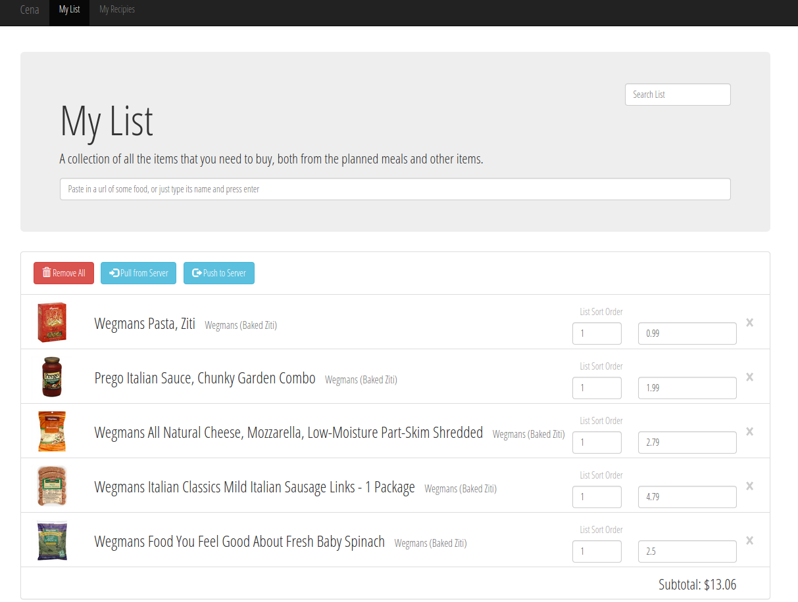

Cena: My take on a grocery list
===

Cena is a grocery list app.

What makes it different is the ability
to paste links from wegmans.com (my local supermarket) and it will
scrape the page, providing an image as well as other information for the product.

Another big feature is recipes: Add whatever items you would like to the list,
and create a new recipe with the list contents. A recipe's ingredients can then be
easily added back into the list whenever the user wants to, for example, plan a whole
week's worth of meals.

Even better, the user can choose to print out the list in different categories (the
list sort order section box in the image above). This allows the list to be sorted
based on the layout of the store, for ease of use.

And lastly, because it's web based, your list is always available online to you
on any internet connected device.

Development
---
Cena is still occasionally worked on by me, but not very often. It's puropse was
for my mom, and unless anyone else suggests anything else, I probably won't add anything
new.

License
---
Copyright (c) 2014 Ryan Gaus and contributors

Permission is hereby granted, free of charge, to any person obtaining a copy
of this software and associated documentation files (the "Software"), to deal
in the Software without restriction, including without limitation the rights
to use, copy, modify, merge, publish, distribute, sublicense, and/or sell
copies of the Software, and to permit persons to whom the Software is
furnished to do so, subject to the following conditions:

The above copyright notice and this permission notice shall be included in
all copies or substantial portions of the Software.

THE SOFTWARE IS PROVIDED "AS IS", WITHOUT WARRANTY OF ANY KIND, EXPRESS OR
IMPLIED, INCLUDING BUT NOT LIMITED TO THE WARRANTIES OF MERCHANTABILITY,
FITNESS FOR A PARTICULAR PURPOSE AND NONINFRINGEMENT. IN NO EVENT SHALL THE
AUTHORS OR COPYRIGHT HOLDERS BE LIABLE FOR ANY CLAIM, DAMAGES OR OTHER
LIABILITY, WHETHER IN AN ACTION OF CONTRACT, TORT OR OTHERWISE, ARISING FROM,
OUT OF OR IN CONNECTION WITH THE SOFTWARE OR THE USE OR OTHER DEALINGS IN
THE SOFTWARE.
